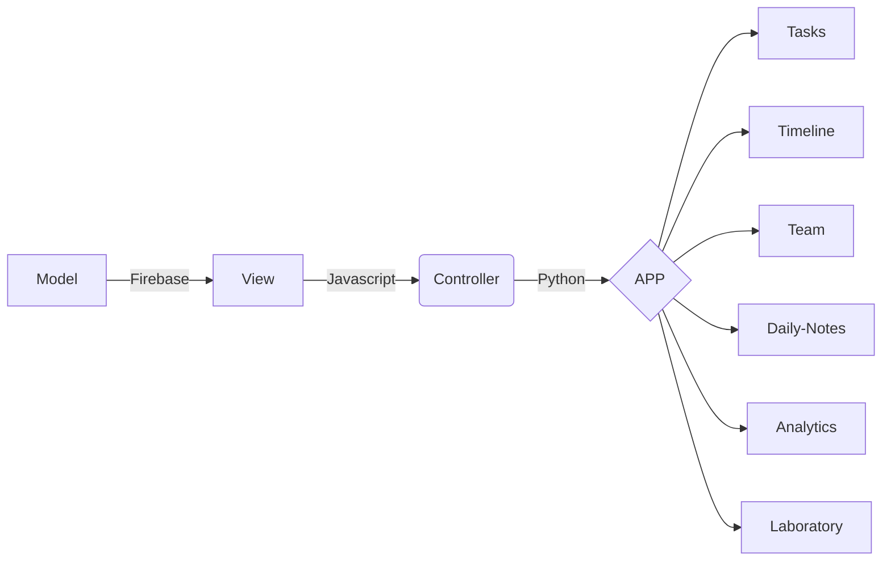

# Sobre o Projeto:
React + Github, desenvolvimento de uma SPA em React e hospedando no GitHub Pages.


### FLUXOGRAMA/DIAGRAMA
```
flowchart LR
A[View] -->|Javascript| B(Controller)
X[Repository] -->|Firebase| A[React-App]
B --> |Python| C{APP}

C --> J[Tasks]
C --> K[Timeline]
C --> L[Team]
C --> M[Daily-Notes]
C --> N[Analytics]
C --> O[Laboratory]

```



